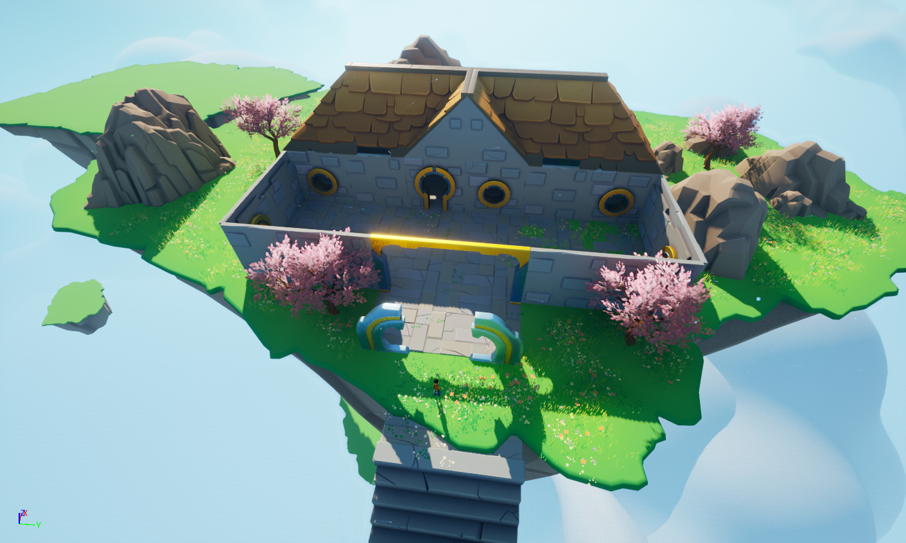
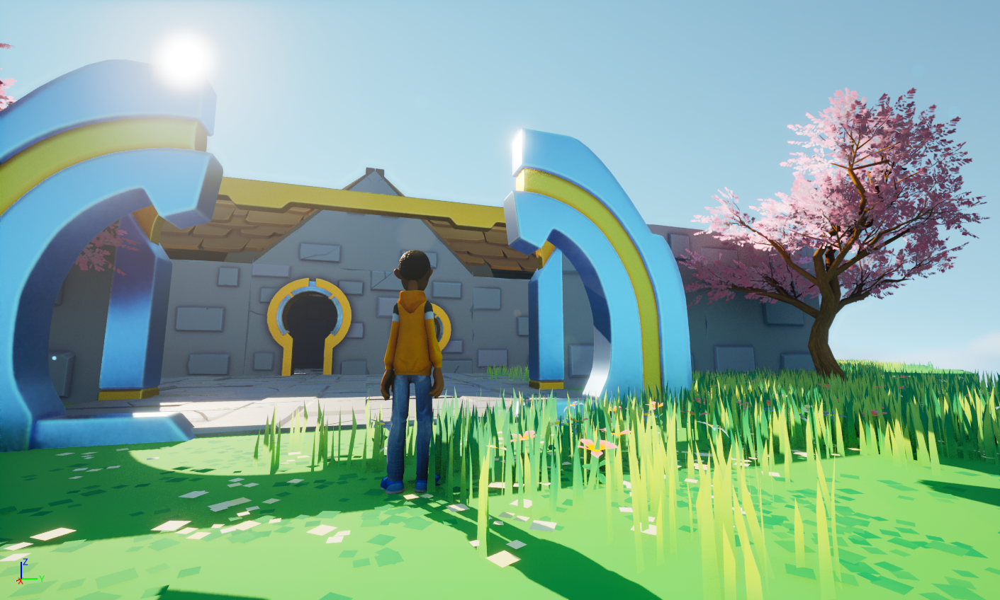
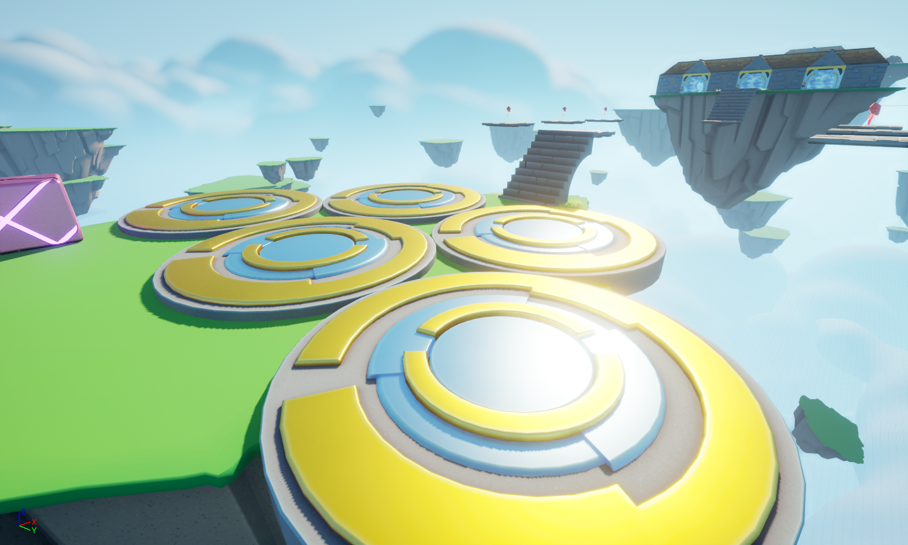
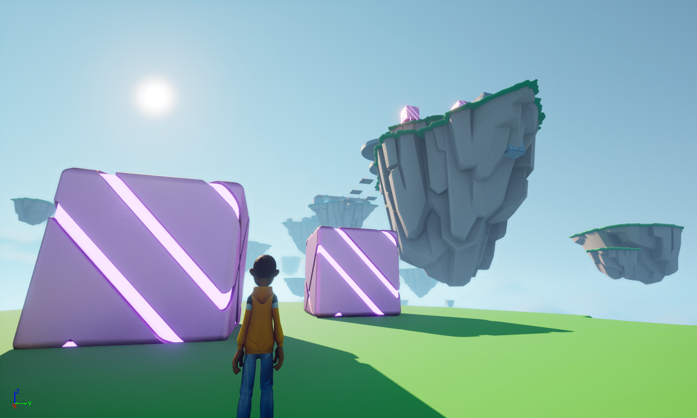

# 🎮 ObstacleAssault

## 🛠️ Developed with Unreal Engine 5.4

A fast-paced, physics-driven action-platformer built in Unreal Engine. Players sprint, jump, and improvise through dynamic obstacle arenas filled with moving platforms, timed traps, and destructible elements that reward precise traversal and quick decisions.

## 📸 Screenshots

## 💡 Why I Built This

ObstacleAssault began as a portfolio prototype to explore satisfying traversal, modular level design, and physics-driven destruction in Unreal. The project demonstrates Blueprint systems, C++ gameplay modules, VFX polish, and level design iteration — a compact showcase for game-jam style prototypes and portfolio screenshots.

## ▶️ How do I get it running?

### Prerequisites

▪️Git & Git LFS installed.

▪️Unreal Engine 5 installed (matching the project version above).

▪️Visual Studio (Windows) with C++ toolset if the project contains C++ code.

### Steps

#### 1. Clone the repo:

git clone https://github.com/Anshuk18/ObstacleAssault.git

cd ObstacleAssault

#### 2. Install Git LFS and pull large assets:

git lfs install

git lfs pull

#### 3. Generate IDE project files (if needed):

- Right-click ObstacleAssault.uproject → Generate Visual Studio project files, or run the UE editor tool to generate them.

#### 4. Open ObstacleAssault.uproject with Unreal Editor. Let the editor update/convert content if prompted.

#### 5. Play / Build:

- Launch the Level from the Editor or build from Visual Studio for a native executable.

- To create a distributable build: Editor → File → Package Project → choose platform.

### Notes

- If you see missing plugins or compile errors, check Plugins/ and Source/ for required modules.

- Default controls, maps, and additional setup instructions should be added below when available.
